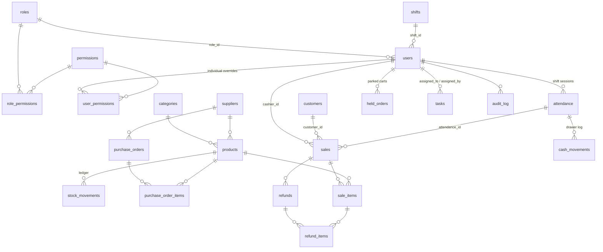

# Database

MySQL 8 / MariaDB 10.6+ (tested against MariaDB inside XAMPP). Schema:
`sql/schema.sql` (23 tables). Demo data: `sql/seed.sql`.

```bash
mysql -u root < sql/schema.sql
mysql -u root smartpos_minimart < sql/seed.sql
```
Or in phpMyAdmin: **Import** tab → choose the file → Go, in that order.

## ERD (entity relationships)



## Table reference (23 tables)

| Table | Purpose | Key constraints |
|---|---|---|
| `settings` | Runtime config (exchange rate, tax) as key/value | string PK |
| `roles` | Super Admin / Admin / Inventory Manager / Cashier | `is_system` flag |
| `permissions` | 25 named capabilities, grouped for the matrix UI | unique `name` |
| `role_permissions` | Role → permission junction | composite PK |
| `user_permissions` | Individual overrides on top of a role | composite PK |
| `shifts` | Morning/Afternoon/Evening/Night templates | unique `name` |
| `users` | Staff accounts | FK `role_id` RESTRICT, FK `shift_id` SET NULL, `is_active` for deactivation |
| `categories` | Merchandise categories | unique `name` |
| `suppliers` | Supplier directory | unique `name` |
| `products` | Catalog items | unique `sku`, unique `barcode`; `CHECK (price > 0)`, `CHECK (quantity_in_stock >= 0)` |
| `stock_movements` | Append-only inventory ledger | `CHECK (change_amount <> 0)`; `reason` ENUM incl. damaged/breakage/count_adjustment/supplier_return/internal_use/purchase_order |
| `purchase_orders` | Supplier orders | `status` ENUM draft/ordered/received/cancelled |
| `purchase_order_items` | PO line items | unique `(po_id, product_id)` |
| `customers` | Loyalty members | unique `phone`, `CHECK (points >= 0)` |
| `attendance` | One row per clock-in→clock-out shift | `opening_float/expected_cash/counted_cash/cash_difference` |
| `sales` | Completed checkouts | dual-currency columns (`currency_mode`, `cash_usd`, `cash_khr`, `change_usd`, `change_khr`, `exchange_rate`), `discount_type/value`, `points_redeemed/discount` |
| `sale_items` | Sale line items | snapshots `product_name`/`unit_price` at sale time so later catalog edits never rewrite history; per-line `note` |
| `refunds` | Refund header | optional `attendance_id` — cash refunds are paid from a drawer |
| `refund_items` | Refund line items | `CHECK (quantity > 0)` |
| `held_orders` | Parked carts | `cart_json` (cart + discount/customer/points state) |
| `cash_movements` | Append-only per-shift cash log | `kind` ENUM float/sale/refund/cash_in/cash_out |
| `tasks` | Team task board | `priority`/`status` ENUMs, `due_date` |
| `audit_log` | Append-only security/ops trail | no UPDATE/DELETE anywhere in the app |

## Data integrity choices

- **Nothing is hard-deleted once it has history.** Deactivating a staff
  member sets `is_active = 0` and records a reason; their sales, refunds and
  shifts keep pointing at the same row. `StaffService.delete_staff()` refuses
  to delete an account that has any sales/refunds/shifts
  (`UserRepository.has_history()`).
- **Guarded UPDATEs instead of application-level locks.**
  `products.quantity_in_stock` only ever changes through
  `ProductRepository.adjust_stock()`, whose `WHERE` clause
  (`quantity_in_stock + %s >= 0`) makes a negative-stock race impossible even
  under concurrent tills. `PurchaseOrderRepository.set_status()` and
  `SaleRepository.add_refunded_quantity()` use the same guarded-UPDATE
  pattern so two people can't double-process the same order or refund.
- **Money snapshots.** `sale_items` stores the product's name and price *at
  the time of sale*; editing a product later never rewrites old receipts.
- **Least-privilege application account** (commented at the bottom of
  `sql/schema.sql`): a `smartpos_app` MySQL user with only
  `SELECT, INSERT, UPDATE, DELETE` — no `DROP`/`ALTER` — for day-to-day
  running.

## Backup & restore

```bash
bash scripts/backup_db.sh root smartpos_minimart      # writes backups/smartpos_minimart_<timestamp>.sql
bash scripts/restore_db.sh backups/<file>.sql root smartpos_minimart
```
